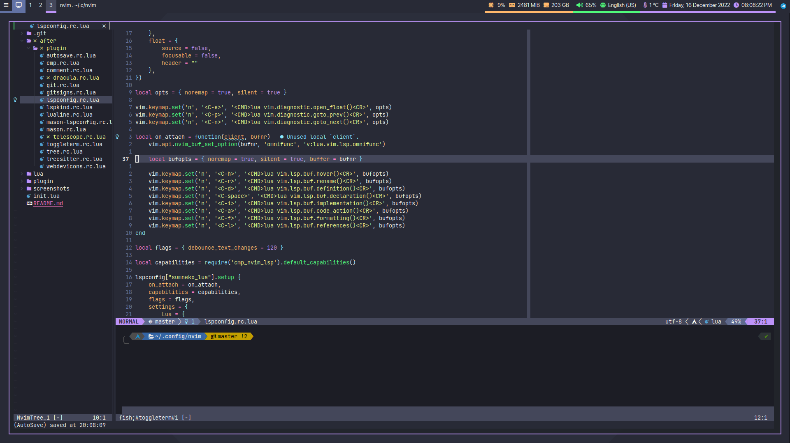
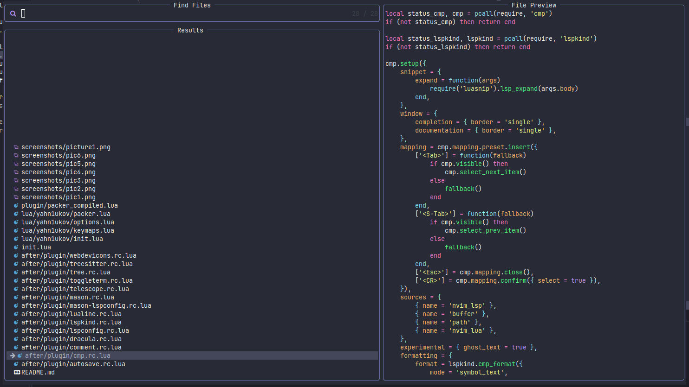
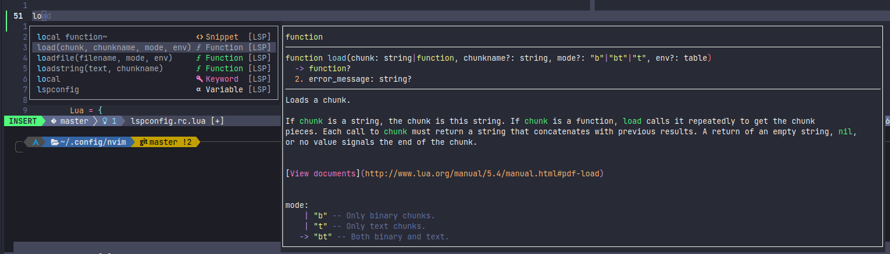
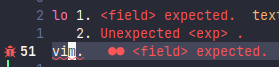
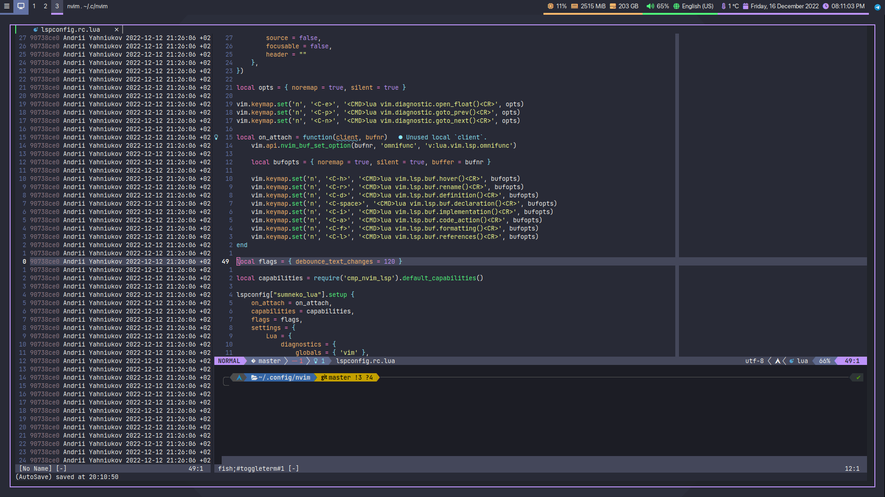
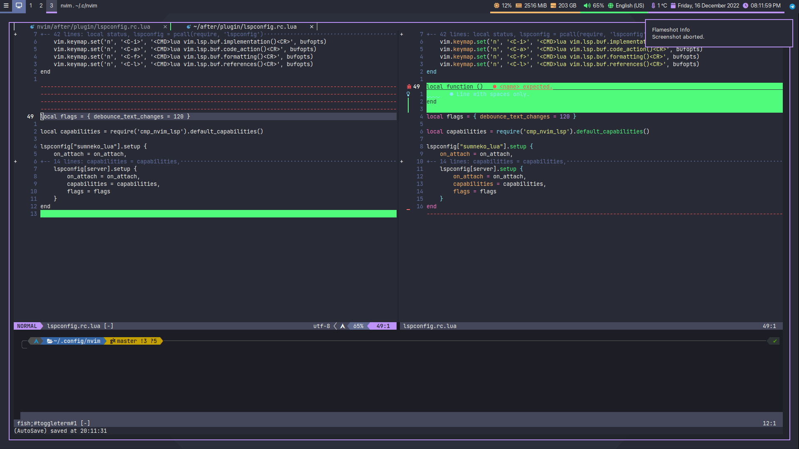

# My Neovim Configuration

## Content

- [Requirements](#requirements)
- [Languages](#languages)
- [Plugins](#plugins)
- [Keymaps](#keymaps)
- [Screenshots](#screenshots)

## Requirements

- [Neovim](https://github.com/neovim/neovim)
- [JetBrains Nerd Font](https://www.nerdfonts.com/font-downloads) (default font for your terminal)
- [fd](https://github.com/sharkdp/fd)
- [ripgrep](https://github.com/BurntSushi/ripgrep)
- [Packer](https://github.com/wbthomason/packer.nvim)
- Install next on your machine:
  - [Python](https://www.python.org/)
  - [.NET](https://dotnet.microsoft.com/en-us/download)
  - [Golang](https://go.dev/)
  - [Rust](https://www.rust-lang.org/)
  - [C/C++](https://clangd.llvm.org/installation.html)
- Install next npm packages:
  - [typescript-language-server](https://www.npmjs.com/package/typescript-language-server)
  - [bash-language-server](https://www.npmjs.com/package/bash-language-server)
  - [neovim](https://www.npmjs.com/package/neovim)

## Languages

|Name|LSP|
|-|-|
|Lua|sumneko_lua|
|C/C++|clangd|
|Python|pyright|
|C#|csharp_ls|
|Golang|gopls|
|Rust|rust_analyzer|
|JS/TS|tsserver|
|Bash|bashls|

## Plugins

- [wbthomason/packer.nvim](https://github.com/wbthomason/packer.nvim)
- [Mofiqul/dracula.nvim](https://github.com/Mofiqul/dracula.nvim)
- [nvim-lualine/lualine.nvim](https://github.com/nvim-lualine/lualine.nvim)
- [kyazdani42/nvim-web-devicons](https://github.com/nvim-tree/nvim-web-devicons)
- [907th/vim-auto-save](https://github.com/907th/vim-auto-save)
- [jiangmiao/auto-pairs](https://github.com/jiangmiao/auto-pairs)
- [terrortylor/nvim-comment](https://github.com/terrortylor/nvim-comment)
- [akinsho/toggleterm.nvim](https://github.com/akinsho/toggleterm.nvim)
- [romgrk/barbar.nvim](https://github.com/romgrk/barbar.nvim)
- [kyazdani42/nvim-tree.lua](https://github.com/nvim-tree/nvim-tree.lua)
- [nvim-telescope/telescope.nvim](https://github.com/nvim-telescope/telescope.nvim)
- [nvim-lua/plenary.nvim](https://github.com/nvim-lua/plenary.nvim)
- [nvim-treesitter/nvim-treesitter](https://github.com/nvim-treesitter/nvim-treesitter)
- [neovim/nvim-lspconfig](https://github.com/neovim/nvim-lspconfig)
- [williamboman/mason.nvim](https://github.com/williamboman/mason.nvim)
- [williamboman/mason-lspconfig.nvim](https://github.com/williamboman/mason-lspconfig.nvim)
- [hrsh7th/nvim-cmp](https://github.com/hrsh7th/nvim-cmp)
- [hrsh7th/cmp-buffer](https://github.com/hrsh7th/cmp-buffer)
- [hrsh7th/cmp-path](https://github.com/hrsh7th/cmp-path)
- [hrsh7th/cmp-nvim-lsp](https://github.com/hrsh7th/cmp-nvim-lsp)
- [hrsh7th/cmp-nvim-lua](https://github.com/hrsh7th/cmp-nvim-lua)
- [onsails/lspkind-nvim](https://github.com/onsails/lspkind.nvim)
- [L3MON4D3/LuaSnip](https://github.com/L3MON4D3/LuaSnip)
- [dinhhuy258/git.nvim](https://github.com/dinhhuy258/git.nvim)
- [lewis6991/gitsigns.nvim](https://github.com/lewis6991/gitsigns.nvim)
- [glepnir/lspsaga.nvim](https://github.com/glepnir/lspsaga.nvim)

## Keymaps

|Mode|Keymap|Action|
|-|-|-|
||**Navigation**||
|normal|Shift+h|navigate to left|
|normal|Shift+j|navigate to down|
|normal|Shift+k|navigate to up|
|normal|Shift+l|navigate to right|
||**Window**||
|normal|Shift+v|split horizontally|
|normal|Shift+s|split vertically|
||**Buffer**||
|normal|Tab|next buffer|
|normal|Shift+Tab|previous buffer|
|normal|Shift+q|close buffer|
||**Sidebar**||
|normal|Shift+n|toggle sidebar|
||**Finder**||
|normal|Shift+f|find files|
||**Terminal**||
|normal|Shift+t|open terminal|
||**Comments**||
|normal|c|comment line|
|normal|cc|comment block|
||**Autocompletion**||
|insert|Tab|next suggestion|
|insert|Shift+Tab|previous suggestion|
|insert|Esc|close autocompletion|
|insert|Enter|confirm suggestion|
||**Git**||
|normal|gb|open blame window|
|normal|gq|close blame window|
|normal|Enter|open blame commit|
|normal|gd|open diff window|
|normal|gq|close diff window|
||**LSP**||
|normal|Ctrl+e|show errors|
|normal|Ctrl+n|next error|
|normal|Ctrl+p|previous error|
|normal|Ctrl+h|hover documentation|
|normal|Ctrl+r|rename|
|normal|Ctrl+d|definition|
|normal|Ctrl+Space|declaration|
|normal|Ctrl+i|impletitation|
|normal|Ctrl+a|code action|
|normal|Ctrl+f|code formatting|
|normal|Ctrl+l|window reference|

## Screenshots

