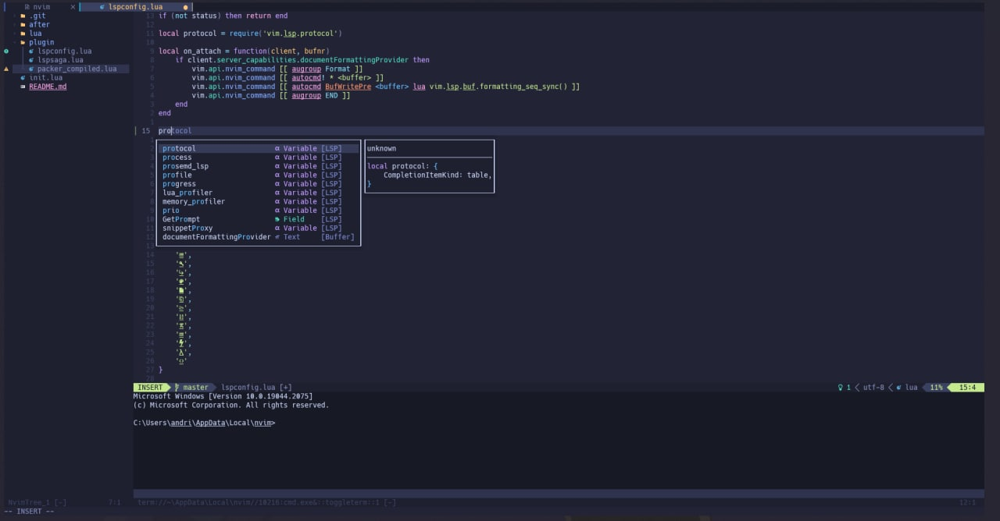
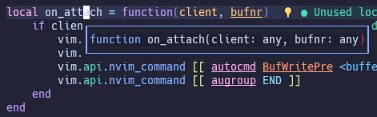
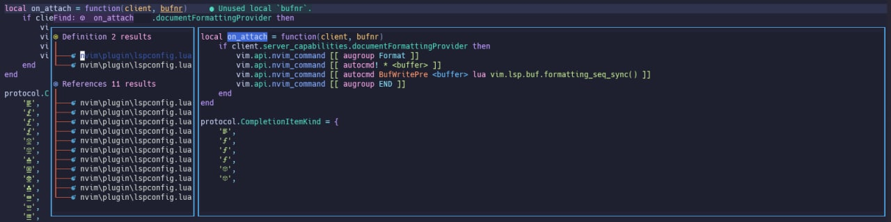
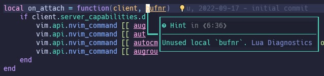
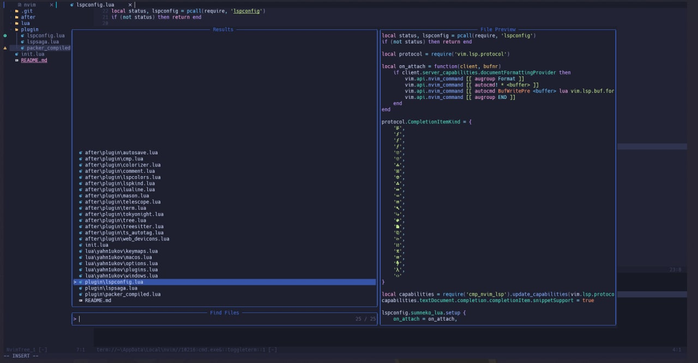

# My Neovim configuration

## Content

- [Languages and technologies](#languages-and-technologies)
- [Plugins](#plugins)
- [Keymaps](#keymaps)
- [Screenshots](#screenshots)

## Languages and technologies

- `C`
- `C++`
- `Python`
- `Lua`

## Plugins:

- [wbthomason/packer.nvim](https://github.com/wbthomason/packer.nvim)
- [Mofiqul/dracula.nvim](https://github.com/Mofiqul/dracula.nvim)
- [nvim-lualine/lualine.nvim](https://github.com/nvim-lualine/lualine.nvim)
- [nvim-lua/plenary.nvim](https://github.com/nvim-lua/plenary.nvim)
- [neovim/nvim-lspconfig](https://github.com/neovim/nvim-lspconfig)
- [onsails/lspkind-nvim](https://github.com/onsails/lspkind.nvim)
- [hrsh7th/cmp-buffer](https://github.com/hrsh7th/cmp-buffer)
- [hrsh7th/cmp-nvim-lsp](https://github.com/hrsh7th/cmp-nvim-lsp)
- [hrsh7th/nvim-cmp](https://github.com/hrsh7th/nvim-cmp)
- [williamboman/mason.nvim](https://github.com/williamboman/mason.nvim)
- [williamboman/mason-lspconfig.nvim](https://github.com/williamboman/mason-lspconfig.nvim)
- [glepnir/lspsaga.nvim](https://github.com/glepnir/lspsaga.nvim)
- [folke/lsp-colors.nvim](https://github.com/folke/lsp-colors.nvim)
- [L3MON4D3/LuaSnip](https://github.com/L3MON4D3/LuaSnip)
- [kyazdani42/nvim-tree.lua](https://github.com/kyazdani42/nvim-tree.lua)
- [kyazdani42/nvim-web-devicons](https://github.com/kyazdani42/nvim-web-devicons)
- [nvim-telescope/telescope.nvim](https://github.com/nvim-telescope/telescope.nvim)
- [nvim-telescope/telescope-file-browser.nvim](https://github.com/nvim-telescope/telescope-file-browser.nvim)
- [romgrk/barbar.nvim](https://github.com/romgrk/barbar.nvim)
- [907th/vim-auto-save](https://github.com/907th/vim-auto-save)
- [jiangmiao/auto-pairs](https://github.com/jiangmiao/auto-pairs)
- [norcalli/nvim-colorizer.lua](https://github.com/norcalli/nvim-colorizer.lua)
- [terrortylor/nvim-comment](https://github.com/terrortylor/nvim-comment)
- [dinhhuy258/git.nvim](https://github.com/dinhhuy258/git.nvim)
- [lewis6991/gitsigns.nvim](https://github.com/lewis6991/gitsigns.nvim)
- [nvim-treesitter/nvim-treesitter](https://github.com/nvim-treesitter/nvim-treesitter)

## Keymaps

|Mode|Keymap|Action|
|-|-|-|
|`normal`|`Shift + h`|`navigate to left`|
|`normal`|`Shift + j`|`navigate to down`|
|`normal`|`Shift + k`|`navigate to up`|
|`normal`|`Shift + l`|`navigate to right`|
|`normal`|`Shift + s`|`split vertical`|
|`normal`|`Shift + v`|`split horizontal`|
|`normal`|`Shift + n`|`toggle sidebar`|
|`normal`|`Shift + f`|`find files`|
|`normal`|`Tab`|`next tab`|
|`normal`|`Shift + Tab`|`previous tab`|
|`normal`|`Shift + q`|`close tab`|
|`normal`|`Ctrl + d`|`diagnostic jump next`|
|`normal`|`Ctrl + h`|`hover doc`|
|`normal`|`Ctrl + f`|`find variable reference`|
|`normal`|`Ctrl + p`|`find variable definition`|
|`normal`|`Ctrl + r`|`rename variable`|
|`insert`|`Tab`|`next suggestion`|
|`insert`|`Shift + Tab`|`previous suggestion`|
|`insert`|`Esc`|`close suggestions`|
|`insert`|`Enter`|`accept suggestion`|

## Screenshots

